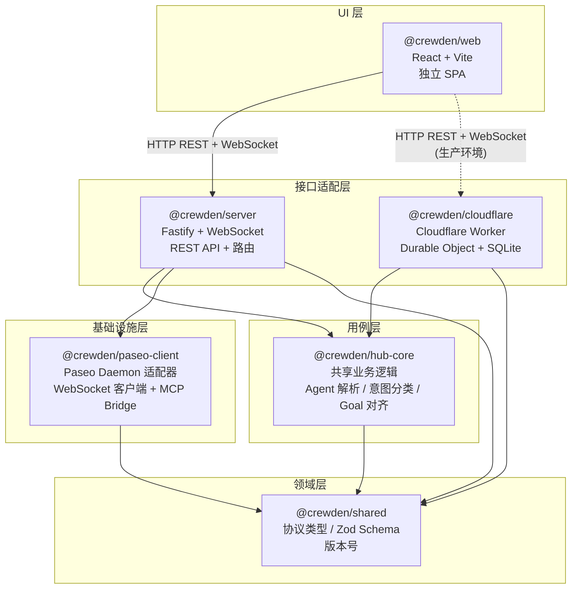
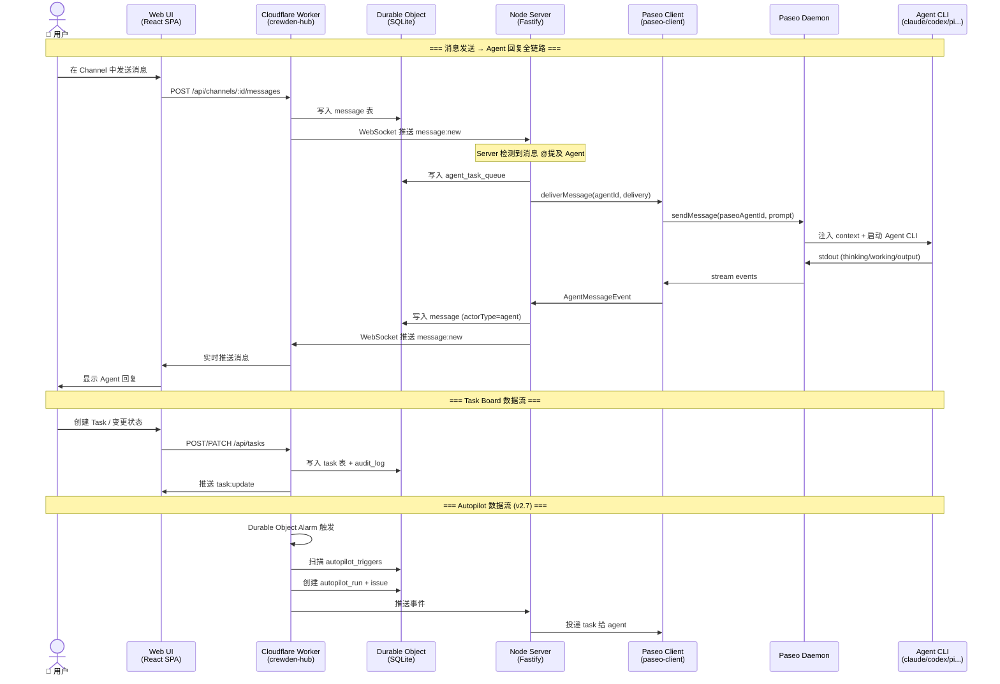
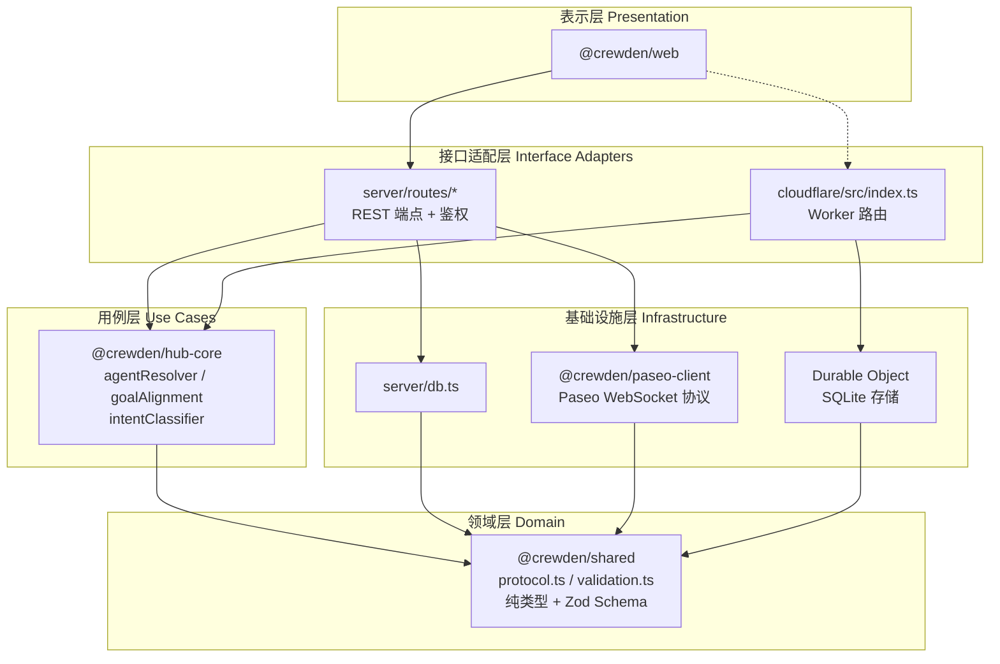
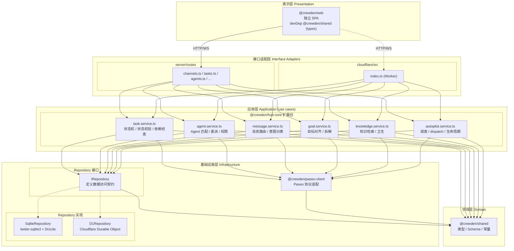

# Crewden 架构分析报告

> 日期：2026-05-06（原始分析）
> 更新：2026-05-09（v2.4.1 后补充）
> 代码库分析范围：packages/ 下 6 个子包（shared、hub-core、paseo-client、server、cloudflare、web）

---

## 一、包依赖关系图



**依赖方向**：所有箭头指向 `shared`（最底层），无一反向依赖。

实际 `package.json` 验证：

| 包 | 依赖的内部包 |
|---|---|
| `shared` | 无 |
| `hub-core` | `shared` |
| `paseo-client` | `shared` |
| `server` | `shared`, `hub-core`, `paseo-client` |
| `cloudflare` | `shared`, `hub-core` |
| `web` | **无内部包依赖**（独立 SPA，通过 HTTP/WS 与后端通信） |

---

## 二、运行时数据流图



### 关键数据流决策

1. **Cloudflare 是单一数据源** — 所有持久化数据的读写都走 Cloudflare Worker → Durable Object SQLite
2. **Server 不直接写本地 DB** — 本地 `better-sqlite3` 仅用于迁移/开发，生产环境通过 Cloudflare API 操作数据
3. **Web 是纯前端** — 不依赖任何 `@crewden/*` 包，TypeScript 类型需在 Web 侧独立维护
4. **消息推送链路**：Agent → Paseo Daemon → Paseo Client → Server → Cloudflare → Web

---

## 三、分层架构评估

### 3.1 分层映射



### 3.2 分层合规评估

| Clean Architecture 原则 | 当前状态 | 评估 |
|---|---|---|
| **领域层无外部依赖** | `shared` 零内部依赖，纯类型定义 | ✅ 符合 |
| **用例层只依赖领域层** | `hub-core` 只依赖 `shared` | ✅ 符合 |
| **适配层只依赖用例层 + 基础设施** | `server` 依赖 `shared` + `hub-core` + `paseo-client` | ✅ 符合 |
| **基础设施层只依赖领域层** | `paseo-client` 只依赖 `shared` | ✅ 符合 |
| **表示层独立** | `web` 无任何 `@crewden/*` 依赖 | ✅ 符合 |
| **server 与 cloudflare 对等** | 两端各自实现路由，共享 `hub-core` 业务逻辑 | ✅ 符合 |

### 3.3 存在的架构问题

> **v2.4.1 更新（2026-05-09）**：问题 1 已部分解决——Repository 层已提取（`server/src/repository/`），db.ts 从 ~2200 行降至 ~1800 行。问题 2 已部分解决——task 状态机已提取到 `hub-core/src/taskStateMachine.ts`。完整列见下方。

#### 问题 1：`server/db.ts` 是 God File（🟡 v2.4.1 部分解决）

```
packages/server/src/db.ts — ~1800 行（v2.4.1 后，从 ~2200 行降低）
├── 数据访问（部分已提取到 repository/）
├── 业务规则（任务状态机已提取到 hub-core）
├── Agent 生命周期（仍在 db.ts 中）
├── 消息处理（仍在 db.ts 中）
└── 事务管理
```

**v2.4.1 已做**：提取了 Task、Channel、Message、Thread、Project、ContextPackageRef 到 `server/src/repository/`。

**尚待做**：Agent 生命周期、Reminder、Knowledge、Audit 等模块的 repository 提取。

```
packages/server/src/
├── repository/                    ← v2.4.1 新增
│   ├── task.repository.ts
│   ├── channel.repository.ts
│   ├── message.repository.ts
│   ├── thread.repository.ts
│   ├── project.repository.ts
│   └── contextPackageRef.repository.ts
├── db.ts                         ← 连接管理 + 迁移 + 剩余 Store
└── routes/
    └── tasks.ts                  ← HTTP 适配 + 鉴权
```

#### 问题 2：`hub-core` 过薄（🟡 v2.4.1 部分解决）

**v2.4.1 已做**：Task 状态机已提取到 `hub-core/src/taskStateMachine.ts`。

**尚待做**：消息路由、Agent 委派、Goal 对齐等核心规则仍在 server/cloudflare 中有重复实现。留到 v2.5。

#### 问题 3：Web 端类型孤立

`web` 不依赖 `@crewden/shared`，意味着前端需要自己维护 API 返回数据的类型定义。如果 `shared` 中的类型变更，Web 端不会获得 TypeScript 编译期反馈。

**建议**：让 `web` 声明 `@crewden/shared` 为 devDependency（仅类型引用，不增加运行时体积），或生成 OpenAPI schema 从 `shared` 类型自动推导。

#### 问题 4：无 Repository 抽象层

`server/routes/*.ts` 直接调用 `db.ts` 中的函数（如 `getOrCreateDb().createMessage(...)`），没有通过接口抽象。如果需要替换存储后端（如从 SQLite 迁移到 PostgreSQL），需要修改所有 route 文件。

**建议**：引入 Repository 接口，route 依赖接口而非具体实现。

---

## 四、建议的架构优化方案

### 4.1 目标架构



### 4.2 改造优先级

> **v2.4.1 进度（2026-05-09）**：P0 部分完成——Repository 层已提取（Task/Channel/Message/Thread/Project/ContextPackageRef），db.ts 从 ~2200 降至 ~1800 行。P1 部分完成——task 状态机已提取到 `hub-core/src/taskStateMachine.ts`。剩余项见下方。

| 优先级 | 改造项 | 影响范围 | 预估工作量 | v2.4.1 状态 |
|---|---|---|---|---|
| P0 | 拆分 `server/db.ts` → Repository + Service | server 全部路由 | 大 | 🟡 部分完成 |
| P1 | 扩展 `hub-core`，提取 task 状态机、Agent 委派、消息路由等 | server + cloudflare | 中 | 🟡 部分完成 |
| P1 | 定义 Repository 接口 | server + cloudflare | 小 | ⬜ 未开始 |
| P2 | Web 端引入 `@crewden/shared` 类型 | web | 小 | ⬜ 未开始 |
| P3 | 两端 Repository 实现（SQLite + Durable Object） | server + cloudflare | 大 | ⬜ 未开始 |

---

## 五、总结

### 5.1 当前架构评分（v2.4.1 更新）

| 维度 | 评分 | 说明 |
|---|---|---|
| **分层清晰度** | ⭐⭐⭐⭐ | 6 个包职责分明，依赖方向正确 |
| **单向依赖** | ⭐⭐⭐⭐⭐ | 所有箭头指向 `shared`，零反向依赖 |
| **关注点分离** | ⭐⭐⭐⭐ | Repository 层已提取，db.ts 已降到 ~1800 行 |
| **可测试性** | ⭐⭐⭐ | 有 Repository 具体类但无接口，mock 仍不便 |
| **可扩展性** | ⭐⭐⭐⭐ | 新增 repository + route 模式清晰 |
| **可维护性** | ⭐⭐⭐⭐ | God File 问题缓解，剩余 Agent 逻辑等可继续提取 |

### 5.2 结论

Crewden 的包级依赖架构**符合整洁架构的分层原则**——领域层在最底层，用例层居中，适配层在上，表示层独立。依赖方向严格单向，无循环引用。

v2.4.1 解决了两个 P0 问题：db.ts God File 通过 Repository 提取得到缓解（~2200→~1800 行），hub-core 薄层通过 task 状态机提取得到改善。剩余工作（Agent 生命周期提取、Repository 接口定义、Cloudflare 模块化）应在 v2.5-v2.6 中逐步完成。
